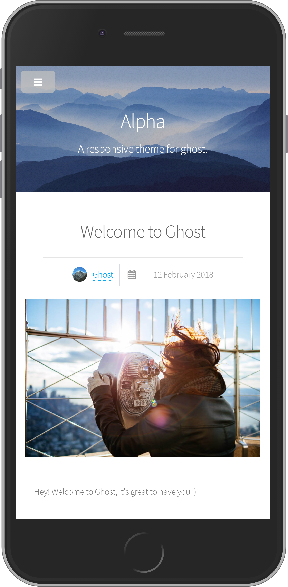

# Alpha

A Ghost theme based on Vue.js and [Alpha](http://html5up.net/alpha).

# Preview

   
---   
   
---   
   

# Installation
Download the latest release on [Github](https://github.com/lss233/Ghost-Alpha/releases/), download the zip, extract the folder, and paste it into your theme folder (content/themes) of your Ghost installation  

# Configuration
There is a `config.js` file in `assets/js` folder, open it and replace the values with your own.  

# Credits
* Design: [HTML5 UP](https://html5up.net)
* [Vue](https://vuejs.org)
* [Axios](https://github.com/axios/axios)
* [Prism](http://prismjs.com/)
* [jQuery](http://jquery.com)
* [Font Awesome](http://fortawesome.github.io/Font-Awesome/)
